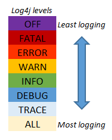

# October2022Batch

What we have done in this branch ?

We will implement to execute suite from maven command line.

1. Add 2 plugins in pom.xml file (surefire plugin and compiler plugin)
    Surefire plugin is responsible to create report and execute test.

2. refresh pom.xml file, and execute below command in command line.

    **mvn clean test  "-Dbrowser=edge"**

    As above you can see, we can pass brosername from command prompt. it will overwrite the browser mentioned in the config file.

    Ensure that respective browser drivers are availble and set in the path variable to execute with different browsers.

3. There are a default testng html report created in target folder.
4. But we also implemented Extent report for a better user experience and detailed information with screenshot for failed tests.

   5.Log4J log levels
      - define **fatal** in root level in log4j properties file,
      -- only fatal logs would be logged in the file/terminal
   
        - define **error** in root level in log4j properties file,
        -- only fatal and error would be logged in the file/terminal
   
        - define **warn** in root level in log4 properties file,
             -- only fatal, error and warning logs would be logged in file/display in terminal
        ...and so on...

        Below picture illustrates for all types
        
      